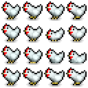
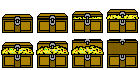

# Sprite Licenses

`Chicken_Sprite_Sheet.png` by [PixelPlant](https://pixelplant.itch.io/) on
Itch.io: https://pixelplant.itch.io/chicken-sprite-sheet

> Feel free to use these sprites personally or for commercial use.

`Explosion.png` by [JROB774](https://opengameart.org/users/jrob774) on
OpenGameArt.org: https://opengameart.org/content/pixel-explosion-12-frames

`MonedaD.png` by [La Red Games](https://laredgames.itch.io/) on Itch.io, part
of their [Gems / Coins Free pack](https://laredgames.itch.io/gems-coins-free).

> License Permissions:
>
> - You can use this asset for personal and commercial purpose.
>
> - Credit is not required but would be appreciated. 
>
> - Modify as you will.

`treasure chest.png` by [r0ar](https://opengameart.org/users/r0ar) on
OpenGameArt.org: https://opengameart.org/content/treasure-chest-sprite

> [Public Domain](http://creativecommons.org/publicdomain/zero/1.0/)
